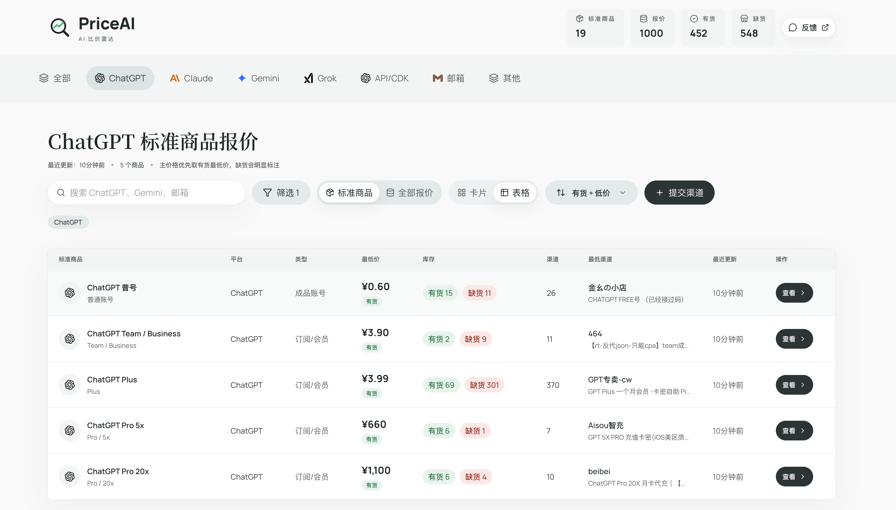

<p align="center">
  
</p>

<h1 align="center">PriceAI</h1>

<p align="center">
  <strong>AI 订阅与模型 API 的比价雷达。</strong><br/>
  先看清官方订阅、卡网低价、官方 API 和中转 API 的价格来源、可用性与风险边界，再决定怎么买、从哪里接入。
</p>

<p align="center">
  <a href="https://priceai.cc">
    
  </a>
  <a href="https://t.me/priceaicc">
    
  </a>
  <a href="https://qm.qq.com/q/ze2W6ADwKk">
    
  </a>
  <a href="https://x.com/dimension4220">
    
  </a>
  <a href="https://linux.do">
    
  </a>
</p>

<p align="center">
  <a href="https://priceai.cc">在线访问</a> ·
  <a href="#四个模块">四个模块</a> ·
  <a href="#为什么做-priceai">为什么做</a> ·
  <a href="#priceai-怎么解决">怎么解决</a> ·
  <a href="#快速开始">快速开始</a> ·
  <a href="#公开文档">公开文档</a> ·
  <a href="#贡献">贡献</a>
</p>

---

<p align="center">
  
</p>

## 四个模块

PriceAI 不再只是一个卡网订阅比价页，而是围绕“AI 能力怎么来”的购买前决策入口。

| 模块 | 解决的问题 | 入口 |
| --- | --- | --- |
| 官方订阅地区价 | ChatGPT、Claude、Gemini、Grok 等官方订阅在不同地区的价格基准 | [官方订阅地区价](https://priceai.cc/official-prices) |
| AI 卡网低价订阅 | 卡网、代充、成品号、卡密、CDK、邮箱等第三方渠道报价分散、命名混乱 | [卡网订阅比价](https://priceai.cc/channels) |
| 官方 API / 模型 API | DeepSeek、Qwen、Kimi、GLM 等 API 入口、免费额度、Token Plan 和限制不容易横向比较 | [API 模型雷达](https://priceai.cc/api-models) |
| 中转 API 比价雷达 | API 中转站倍率、充值系数、模型覆盖、可用性和来源披露不透明 | [API 中转站价格榜](https://priceai.cc/api-transit) |

可以把它理解成四类搜索心智：

- AI 比价雷达
- AI 低价卡网 / AI 卡网低价订阅
- 官方订阅地区价查询
- 中转 API 比价雷达

## 为什么做 PriceAI

AI 产品的价格已经不再只有“去官网订阅”一种答案。

同一个 ChatGPT Plus、Claude Pro、Gemini Pro，可能同时存在官网正价、App Store 地区价、学生或设备权益价、代充价、成品号价、卡密价和第三方渠道价。开发者接入 API 时，也会面对官方 API、免费额度、模型路由、Coding Plan、Token Plan 和中转 API 等不同路径。

问题是，这些信息通常分散在官网文档、App Store 页面、卡网、Telegram 群、闲鱼、公开价格页和中转站后台里。用户很难快速判断：哪个价格是官方基准，哪个是真有货低价，哪个只是过期报价，哪个渠道需要额外承担售后、账号或模型真实性风险。

PriceAI 想把这件事变成一个清楚的购买前参考工具：把分散信息整理成一个可搜索、可比较、可核验的 AI 获取成本雷达。

## PriceAI 怎么解决

PriceAI 不卖货、不收款、不替任何渠道担保。它更像一个购买前决策工具：

- **分清价格来源**：官方订阅、第三方卡网、官方 API 和中转 API 不混成同一种风险。
- **整理标准对象**：把混乱的商品标题、模型名称和站点资料整理成标准商品、标准模型和标准站点。
- **展示可核验信息**：保留来源、原始标题、价格、库存、倍率、更新时间和原站链接。
- **有货最低价优先**：缺货、隐藏、未审核或异常报价不参与外层最低价。
- **保留风险边界**：中转 API 展示倍率、可用性、来源披露和风险标签，不包装成官方 API。
- **支持社区补充**：用户和站长可以提交渠道、站点资料和反馈，经过审核后进入公开列表。

```text
公开来源 / 用户提交 / 站点资料
  -> 采集、导入或人工审核
  -> 标准商品、标准模型、标准站点归类
  -> 展示价格、库存、倍率、来源和更新时间
  -> 用户回到原站核验并自行决策
```

## 当前能力

- **官方订阅地区价**：整理公开地区价格、人民币估算、来源链接和更新时间。
- **卡网订阅比价**：按 ChatGPT、Claude、Gemini、Grok、邮箱、API/CDK、工具账号等整理多渠道报价。
- **API 模型雷达**：整理官方 API、模型路由、免费/测试额度、Token Plan、价格和限制。
- **中转 API 价格榜**：展示第三方中转站的充值系数、模型倍率、综合倍率、近 7 日可用性和来源渠道。
- **指南内容**：解释官方订阅、地区价、卡网渠道、交付方式和风险边界。
- **提交与反馈**：支持用户提交新渠道、API 模型来源、中转站资料和问题反馈。
- **后台管理**：用于来源审核、试采集、分类调整、报价隐藏、采集日志和站点资料维护。

当前线上版本：<https://priceai.cc>

## 不做什么

PriceAI 当前不做交易闭环，不收款，不做担保，也不承诺任何渠道的售后或长期可用性。

PriceAI 也不会把商业合作伪装成客观排名。广告、赞助或 AFF 关系应单独披露，不能直接改变客观排序、最低价计算和风险提示。

## 用户指南

- [AI 订阅卡网渠道靠谱吗？](https://priceai.cc/guides/are-ai-subscription-card-shops-reliable)
- [为什么同一个 AI 订阅价格差这么多？](https://priceai.cc/guides/why-ai-subscription-prices-differ)
- [ChatGPT 有哪些获取方式？](https://priceai.cc/guides/chatgpt-subscription-options)
- [API 中转站是什么？](https://priceai.cc/guides/api-transit)

## FAQ

### PriceAI 是卖 AI 订阅或 API 的吗？

不是。PriceAI 不卖货、不收款、不参与交易，只整理公开或审核通过的价格、来源、库存、倍率、更新时间和原站链接。

### 为什么要把官方订阅、卡网订阅、官方 API 和中转 API 分开？

因为它们的价格来源、风险边界和核验方式完全不同。官方订阅适合作为价格基准，卡网订阅适合看低价现货和交付方式，官方 API 适合看文档、额度和限制，中转 API 则必须额外关注倍率、稳定性和上游披露。

### PriceAI 会担保渠道靠谱吗？

不会。PriceAI 只帮助你看到更多可核验信息。真正购买前仍需要回到原平台确认商品描述、最终价格、售后规则、退款条件和风险。

### GitHub 仓库和 priceai.cc 是什么关系？

GitHub 仓库是 PriceAI 的开源代码和公开说明入口，`priceai.cc` 是线上可使用的比价工具。

## 快速开始

```bash
npm install
npm run dev
```

默认访问：

- 前台：`http://localhost:3000`
- 后台：`http://localhost:3000/admin`

未配置 Supabase 时，前台会使用内置演示数据。完整环境变量见 [配置说明](./public-docs/configuration.md)。

## 常用命令

```bash
npm run dev
npm run build
npm run lint
npm run deploy:production -- --check
npm run deploy:production
npm run collect:prices -- --all --post
npm run collect:prices -- --source aisou-pro --post
npm run collect:browser -- --url https://example.com/ --password your-admin-password --post
```

## 公开文档

- [公开文档索引](./public-docs/README.md)
- [项目架构](./public-docs/architecture.md)
- [配置说明](./public-docs/configuration.md)
- [部署说明](./public-docs/deployment.md)
- [采集器贡献](./public-docs/collectors.md)
- [数据策略](./public-docs/data-policy.md)
- [API 中转站收录说明](./public-docs/api-transit-station-admission.md)
- [公开素材](./assets/README.md)
- [数据与内容授权](./DATA_LICENSE.md)
- [品牌与商标政策](./TRADEMARKS.md)

内部规划、审计、增长方案、运营复盘和 Agent 工作流文件不随开源仓库公开。

## Star 趋势

<a href="https://star-history.com/#physics-dimension/PriceAI&Date">
  <picture>
    <source media="(prefers-color-scheme: dark)" srcset="https://api.star-history.com/svg?repos=physics-dimension/PriceAI&type=Date&theme=dark" />
    <source media="(prefers-color-scheme: light)" srcset="https://api.star-history.com/svg?repos=physics-dimension/PriceAI&type=Date" />
    
  </picture>
</a>

## Roadmap

- 把 README 展示图升级为新的四模块总览图。
- 提高采集稳定性，减少失败来源，完善最近确认时间展示。
- 优化官方订阅、卡网订阅、官方 API 和中转 API 的交叉解释。
- 补充更清晰的交付方式、套餐差异、倍率口径和风险提示。
- 完善用户提交、站长提交、反馈审核和公开披露闭环。

## 贡献

欢迎通过 Issue 或 Pull Request 提交：

- 新渠道采集器
- 价格解析修复
- 商品或模型分类规则优化
- API 中转站公开资料补充
- UI/交互改进
- 公开文档补充

开始前建议先阅读 [CONTRIBUTING.md](./CONTRIBUTING.md)。涉及验证码、登录墙、WAF 或敏感凭据的站点，不应通过绕过限制的方式采集。

## License

PriceAI 的软件代码使用 [GNU Affero General Public License v3.0](./LICENSE) 开源。

`PriceAI` 名称、Logo、域名、视觉品牌、线上生产数据、渠道数据、价格快照、指南内容、截图和公开素材不随软件代码授权。Fork、二次开发或部署公开服务时，请阅读 [数据与内容授权](./DATA_LICENSE.md) 和 [品牌与商标政策](./TRADEMARKS.md)，并避免让用户误认为你的服务是官方 PriceAI。
