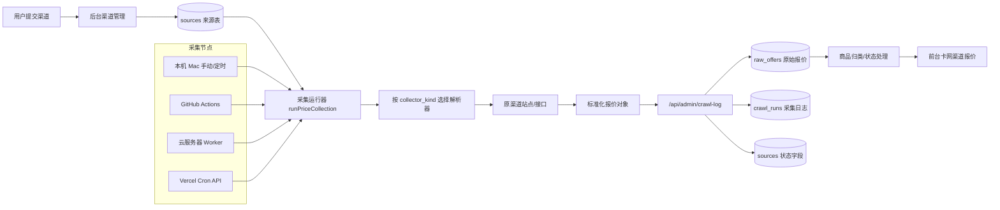
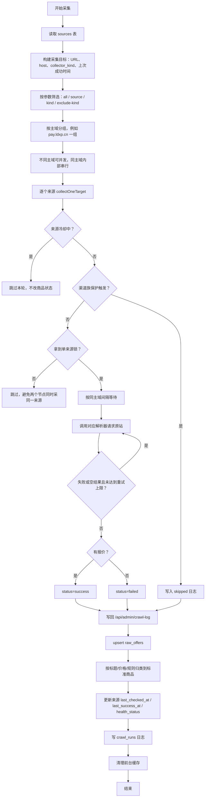
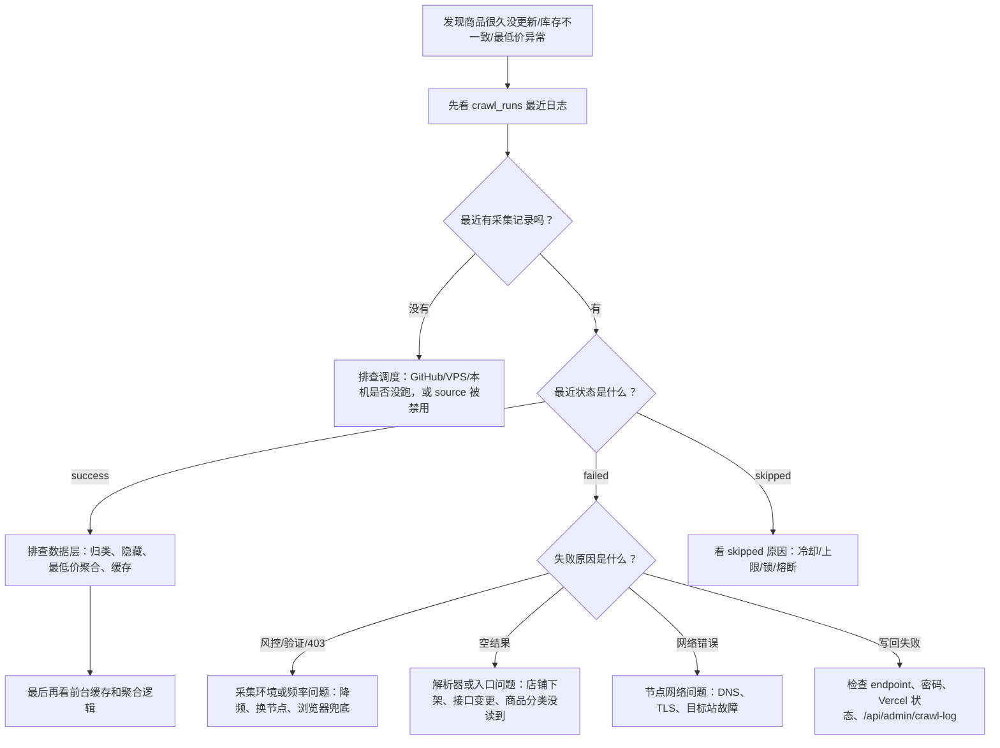

# PriceAI 采集系统总览

生成时间：2026-06-11

这份文档是给产品视角看的采集链路说明。它不要求你理解每一行代码，而是帮你回答：

- PriceAI 的报价数据从哪里来？
- 一个渠道从“被采集”到“前台可见”中间经历了什么？
- 为什么本地能采，云服务器或 GitHub Actions 却可能被风控？
- 以后遇到“很久没更新”“库存不一致”“最低价不对”时，应该先看哪一层？

## 一句话总览

PriceAI 的卡网报价采集不是一个单点脚本，而是一套“多入口触发 + 多解析器读取 + 统一写回 + 统一分类展示”的系统。

最核心的代码入口是：

- `scripts/collect-prices.mjs`：卡网渠道采集主逻辑。
- `src/app/api/admin/crawl-log/route.ts`：采集结果写回入口。
- `src/lib/admin.ts`：报价入库、分类、来源状态更新、缺失商品下架判断。
- `.github/workflows/collect-*.yml`：GitHub Actions 定时采集。
- `scripts/collect-worker.mjs`：云服务器领取后台采集任务。

## 核心概念

| 名词 | 你可以理解成 | 数据/代码位置 |
|---|---|---|
| 来源 / 渠道 | 一个卡网店铺或商品站入口 | `sources` 表 |
| 解析器 | 针对某类网站的读取方式，例如 `kami`、`dujiao`、`shopApi` | `collector_kind` |
| 原始报价 | 从渠道读到的一条商品标题、价格、库存、链接 | `raw_offers` 表 |
| 标准商品 | PriceAI 自己归一化后的商品，例如 ChatGPT Plus、Claude Max 5x | `canonical_products` 和分类规则 |
| 采集日志 | 每次采集某个来源的结果，成功、失败、跳过、错误原因 | `crawl_runs` 表 |
| 采集节点 | 实际发起请求的机器，例如本机 Mac、GitHub Actions、阿里云 VPS | `details.collectorNode` |
| 写回接口 | 采集脚本把结果提交回 PriceAI 后台的 API | `/api/admin/crawl-log` |

## 整体架构图

## 采集触发入口

现在系统里有多种方式会触发采集，它们都会走 `runPriceCollection`，但参数和运行环境不同。

| 入口 | 作用 | 当前特点 | 风险点 |
|---|---|---|---|
| GitHub Actions 主采集 | 每 30 分钟采普通来源 | 排除 `dujiao` 和 `shopApi` | GitHub 出口 IP 可能被部分站点识别为数据中心 |
| GitHub Actions Dujiao | 每 30 分钟采 `dujiao` | 并发 2 | 与其他节点重叠时会增加总请求频率 |
| GitHub Actions ShopApi | 每 30 分钟采 `shopApi` | 并发 2，每轮链动小铺上限 10 | 与 VPS、本机同时跑时，上游看到的是叠加请求 |
| Vercel Cron API | HTTP 方式触发采集 | 最长 300 秒 | 来源多时容易超时，不适合作为重采主力 |
| 云服务器 Worker | 从 `collection_jobs` 领取任务 | `force: true`，默认跳过来源冷却 | 如果调度频繁，容易把同一个来源重复打得太勤 |
| 本机手动补采 | 临时救火或验证 | 可精确点名、低频、便于观察输出 | 不代表长期定时跑也稳定 |
| 浏览器兜底采集 | 动态页或轻量验证页 | 更接近真实用户访问 | 不适合大规模无人值守 |

## 单次采集流程图

## 数据写回与状态更新

采集脚本不会直接操作前台页面。它只负责把结果写回后台 API。

### 成功采集

成功采集时会做几件事：

1. 把本轮读到的报价写入 `raw_offers`。
2. 对报价标题做标准商品归类。
3. 用采集器带回的 `collectedAt` 刷新报价的 `verified_at` / `last_seen_at`，即使价格、库存和标题都没有变化，也能表示“本次已确认”。
4. 更新来源的 `last_checked_at` 和 `last_success_at`。
5. 清除这个来源之前的失败原因。
6. 如果本轮是完整快照，并且旧报价这次没有再出现，会把旧报价标记为疑似下架并隐藏。

### 失败采集

失败采集不等于缺货。

失败时会做几件事：

1. 更新来源的 `last_checked_at`。
2. 保留原来的 `last_success_at`。
3. 累加 `consecutive_failures`。
4. 给旧报价记录 `last_failed_at` 和 `failure_reason`。
5. 连续失败达到阈值后，才会把过久未验证的旧报价标为过期或不可用。

这就是为什么“有货/缺货”和“采集失败”不能混在一起看：

- 商品接口成功返回库存 0，才是缺货。
- 请求被风控、超时、返回验证页，只能说明采集失败。
- 采集失败时直接把商品判缺货，会污染最低价和库存逻辑。

### 跳过采集

`skipped` 通常表示系统主动保护：

- 最近刚采过。
- 同一主域本轮已经达到上限。
- 同一渠道族正在冷却。
- 同一来源被其他节点锁住。

`skipped` 不是失败，也不是缺货。

## 链动小铺类渠道的特殊逻辑

`pay.ldxp.cn`、`pay.qxvx.cn`、`catfk.com` 这类站点都属于 `shopApi` 采集器。

它们有一个共同特点：一个主域下面挂了很多店铺。

例如：

- `https://pay.ldxp.cn/shop/a`
- `https://pay.ldxp.cn/shop/b`
- `https://pay.ldxp.cn/shop/c`

对 PriceAI 来说它们是不同来源；但对 `pay.ldxp.cn` 来说，它们都来自同一个访问出口、同一个主域。

所以代码里做了“渠道族保护”：

| 保护项 | 当前逻辑 |
|---|---|
| 同主域间隔 | 默认 15 秒 |
| 单轮上限 | 默认 20 个链动店铺 |
| HTTP 403 短冷却 | 连续触发后冷却 5 分钟 |
| 验证/风控页熔断 | 当前进程暂停该主域 30 分钟 |
| 主域并发 | 不同主域可并发，同一主域内部串行 |

但是这里有一个非常关键的限制：

**当前渠道族保护主要是进程内状态，不是全局跨节点状态。**

也就是说：

- 本机进程知道自己刚请求过 `pay.ldxp.cn`。
- GitHub Actions 进程知道自己刚请求过 `pay.ldxp.cn`。
- 阿里云 VPS 进程也知道自己刚请求过 `pay.ldxp.cn`。
- 但它们之间没有共享一个“全局链动小铺冷却表”。

在上游站点看来，请求可能是叠加的。

这也是目前采集逻辑里最值得继续优化的地方。

## 为什么本地能采，阿里云 VPS 却容易被风控？

这不是一个单一原因，至少有 6 层因素叠加。

### 1. 本地手动补采和 VPS 定时采集不是同一种压力

本地补采通常是：

- 人工触发。
- 小批量。
- 看到异常就停。
- 可以只跑很久没更新的来源。

VPS 定时采集通常是：

- 按计划自动跑。
- 可能持续、重复、无人值守。
- 可能领取后台队列任务。
- 失败后下次还会再来。

所以“本地刚才能跑通”只能证明当前本机出口、当前小批量、当前时间窗口可用，不能证明长期自动采集也一定可用。

### 2. VPS 是数据中心 IP，部分站点天然更敏感

很多卡网站点会对云服务器 IP 更敏感，尤其是：

- 阿里云、腾讯云、GitHub Actions、Vercel 这类数据中心出口。
- 高频访问同一接口。
- 没有浏览器 Cookie 和 JS 运行痕迹的纯 HTTP 请求。

本机网络更像普通用户网络，有时反而更容易过。

但这不是绝对的。最近一次日志里，`Ai能量小店` 在本机、GitHub、广州 VPS 都出现过风控，说明有些站点是接口本身加强了校验，不是单纯 VPS 的问题。

### 3. 云服务器 Worker 当前会 `force: true`

`scripts/collect-worker.mjs` 里，渠道任务调用 `runPriceCollection` 时带了 `force: true`。

这会跳过普通来源冷却。

它的好处是后台手动派发任务时能立即执行；坏处是如果队列或定时任务过于频繁，就可能对同一个来源重复采集。

这点和“紧急补采”冲突不大，但和“长期稳定自动采集”冲突比较大。

### 4. 单来源锁不能解决同主域过频

系统有 `acquire_source_collection_lock`，可以避免两个节点同时采同一个来源。

但它锁的是单个 `source_id`，不是整个 `pay.ldxp.cn`。

举例：

- GitHub 正在采 `pay.ldxp.cn/shop/a`
- VPS 正在采 `pay.ldxp.cn/shop/b`
- 本机正在采 `pay.ldxp.cn/shop/c`

这三个来源的锁都不会冲突，但上游主域看到的是同一时间有多个店铺接口请求。

### 5. 单个来源手动采集默认不启用渠道族保护

代码里为了方便排查，单个 `--source xxx` 采集默认不会套完整的批量限速。

这样排查单点问题很方便，但如果用脚本循环很多个 `--source`，就等于绕开了一部分全量采集保护。

紧急补采时我们已经手动加了共享 `collectionFamilyState` 和间隔，所以这次没有触发 403。但长期脚本如果没有这么做，风险会更高。

### 6. 风控状态有“记忆”

有些站点触发风控后，并不是你立刻降频就恢复。

可能出现：

- 当前 IP 被短期标记。
- 某个 Cookie 或访问会话进入挑战状态。
- 接口从 JSON 变成 HTML 验证页。
- 同一时间段内任何请求都继续失败。

所以一旦进入风控窗口，正确动作通常是停一段时间，而不是继续重试。

## 最近一次排查观察

按最近 24 小时的采集日志抽样看，广州 VPS 不是完全不能采，但它是当前最高频的采集出口。

| 节点 | 日志数 | 成功 | 失败 | 跳过 | 风控类失败 |
|---|---:|---:|---:|---:|---:|
| `cn-vps-aliyun-guangzhou` | 585 | 288 | 108 | 0 | 80 |
| `local-mac-emergency` | 161 | 78 | 1 | 81 | 0 |
| `local-mac` | 131 | 40 | 8 | 82 | 2 |
| `github-actions` | 4 | 1 | 2 | 0 | 1 |

这个结果说明：

- 阿里云 VPS 仍然能采到大量数据。
- 但它承担了最多请求，因此也暴露出最多风控。
- 风控并非只发生在阿里云 VPS，部分站点在本机和 GitHub 也会失败。
- 目前更像是“调度和全局限频需要收敛”，而不是“某台机器完全不可用”。

## 遇到问题时怎么判断是哪一层

## 当前采集逻辑的主要风险点

| 风险点 | 当前表现 | 建议 |
|---|---|---|
| 多节点叠加请求 | GitHub、VPS、本机都可能采同类来源 | 明确每类来源的主采集节点 |
| 链动小铺保护不是全局状态 | 每个进程只知道自己的冷却 | 增加 Supabase 全局 `source_family_locks` 或 `collector_family_state` |
| Worker 使用 `force: true` | 跳过普通来源冷却 | 定时任务不默认 force，只有手动紧急任务 force |
| 单来源锁粒度太细 | 不防同主域多个店铺并行 | 增加主域级锁或队列 |
| 风控失败和空结果混在“失败”里 | 运营判断成本高 | 在后台把 `waf-or-challenge`、`empty-result`、`network` 分组展示 |
| 采集入口分散 | 不容易知道谁在跑 | 做采集节点看板，展示近 24h 每个节点成功率 |

## 建议的下一阶段架构调整

### P0：先把采集职责收敛

短期先定一个原则：

- `shopApi / 链动小铺`：只允许一个主节点负责定时采集。
- GitHub Actions 可以保留普通来源和 `dujiao`。
- 本机只用于紧急补采和调试，不作为常规自动采集主力。
- 如果 VPS 继续承担 `shopApi`，GitHub 的 shopApi workflow 就要么降频，要么暂停。

这样可以先减少重叠请求。

### P1：增加全局渠道族冷却

在 Supabase 增加一张类似这样的状态表：

| 字段 | 作用 |
|---|---|
| `family_key` | 例如 `shopApi:pay.ldxp.cn` |
| `locked_by` | 当前采集节点 |
| `locked_until` | 主域级锁结束时间 |
| `last_started_at` | 最近一次请求开始时间 |
| `http403_count` | 近期 403 次数 |
| `breaker_until` | 风控熔断到什么时候 |
| `updated_at` | 更新时间 |

这样本机、GitHub、VPS 就能共享同一套链动小铺冷却状态。

### P2：调整 Worker 的 force 策略

把 Worker 区分成两种任务：

| 类型 | 是否 force | 场景 |
|---|---|---|
| 定时自动任务 | 否 | 常规刷新，尊重冷却 |
| 手动紧急任务 | 是 | 明确人工触发的补采 |

这样可以避免后台队列把某个站点打得过密。

### P3：给来源配置采集节点偏好

后续可以给 `sources` 增加类似字段：

- `preferred_collector_node`
- `blocked_nodes`
- `collector_policy`

例如：

| 来源类型 | 建议节点 |
|---|---|
| 普通公开 API | GitHub Actions |
| 国内卡网站 | 国内 VPS |
| 容易风控的动态页 | 本机浏览器兜底 |
| 链动小铺 | 单一低频节点 |

### P4：后台做采集健康看板

建议后台增加：

- 节点成功率。
- 按解析器成功率。
- 按失败原因分组。
- 长期失败来源列表。
- 近 24h 风控最多的来源。
- 最近一次成功和最近一次失败对比。

这样你不用每次让我查数据库，也能自己快速判断是调度问题、解析器问题，还是源站问题。

## 一张运营视角的判断表

| 你看到的现象 | 优先判断 | 下一步 |
|---|---|---|
| 很久没更新，但最近没有 crawl_runs | 调度没跑或来源没被选中 | 查 workflow、worker、来源 enabled |
| 很久没更新，但最近都是 failed | 采集器或风控问题 | 看失败原因分组 |
| 最近 success，但前台没变化 | 数据聚合、分类、缓存问题 | 查 `raw_offers`、标准商品、缓存 |
| 原站有货，PriceAI 显示缺货 | 库存解析或旧报价状态问题 | 查该来源最近成功快照和商品状态 |
| 原站下架，PriceAI 还显示 | 完整快照未覆盖或旧报价未隐藏 | 查 `seenOfferIds` 和 fullSnapshot |
| VPS 总是风控，本机偶尔能跑 | 节点出口/频率/全局限频问题 | 收敛节点，增加主域级冷却 |
| 某渠道采集结果为空 | 入口失效、商品分类未读到、解析器不支持 | 单独试采并查看原站结构 |

## 当前结论

这次问题的根源不只是某个采集器坏了，而是采集系统已经进入“多节点、多来源、多解析器”阶段，原来的进程内限频已经不够用了。

更准确的判断是：

1. 采集器本身能读很多来源，说明核心解析器不是整体失效。
2. 阿里云 VPS 失败多，部分原因是它承担了最高频的定时任务。
3. 本地能补采成功，是因为人工低频、小批量、可观察，不代表长期自动跑稳定。
4. 当前最需要补的是“全局调度和全局限频”，尤其是 `shopApi:pay.ldxp.cn` 这种同主域多店铺场景。
5. 后续应该把采集体系从“脚本能跑”升级成“可运营、可观察、可控频率”的系统。
